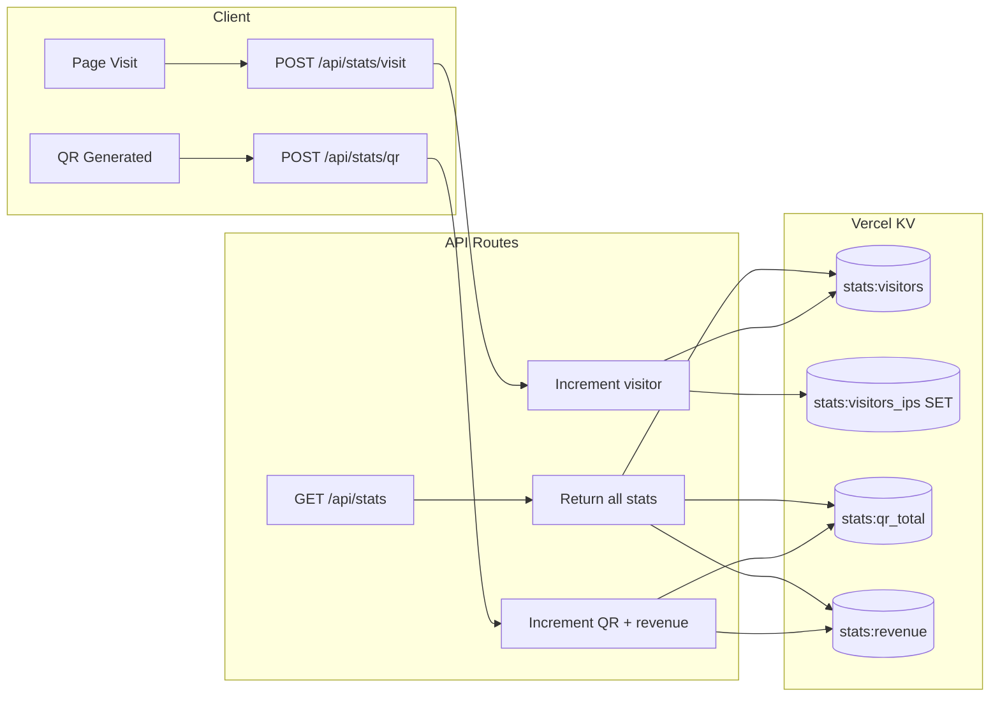

# Vercel KV Stats Implementation

## Architecture



## KV Data Structure

| Key | Type | Description |

|-----|------|-------------|

| `stats:visitors` | number | Total unique visitor count |

| `stats:visitors:ips` | SET | Hashed visitor IPs (for deduplication) |

| `stats:qr_total` | number | Total QR codes generated |

| `stats:revenue` | number | Sum of all payment amounts (EUR cents) |

## Files to Create/Modify

### 1. Install Vercel KV

```bash
bun add @vercel/kv
```

### 2. API Routes

**`app/api/stats/route.ts`** - GET endpoint to fetch all stats (public, cached 60s)

**`app/api/stats/visit/route.ts`** - POST to track unique visitors using hashed IP

**`app/api/stats/qr/route.ts`** - POST to increment QR count + add amount to revenue

### 3. Stats Components

**`components/stats-section.tsx`** - Dedicated stats display with 3 cards:

- Unique visitors (with user icon)
- QR codes generated (with QR icon)
- Total revenue in EUR (with currency icon)

### 4. Integration Points

**`app/page.tsx`** - Add `<StatsSection />` below the main content

**`components/payment-qr-page.tsx`** - Call `/api/stats/qr` after successful QR generation

**`app/layout.tsx`** - Add visitor tracking hook/component

### 5. Visitor Tracking

Create a client component `components/track-visitor.tsx` that fires once per session (using sessionStorage flag) to avoid over-counting page refreshes.

## Environment Variables Required

After running `vercel env pull`, these will be available:

- `KV_REST_API_URL`
- `KV_REST_API_TOKEN`
- `KV_REST_API_READ_ONLY_TOKEN`
- `KV_URL`

## Notes

- Revenue stored in **cents** (integers) to avoid floating point issues
- Visitor IPs are hashed (SHA-256) before storing for privacy
- Stats endpoint cached with `revalidate: 60` to reduce KV reads
- Use `INCRBYFLOAT` for revenue to handle decimal amounts if needed